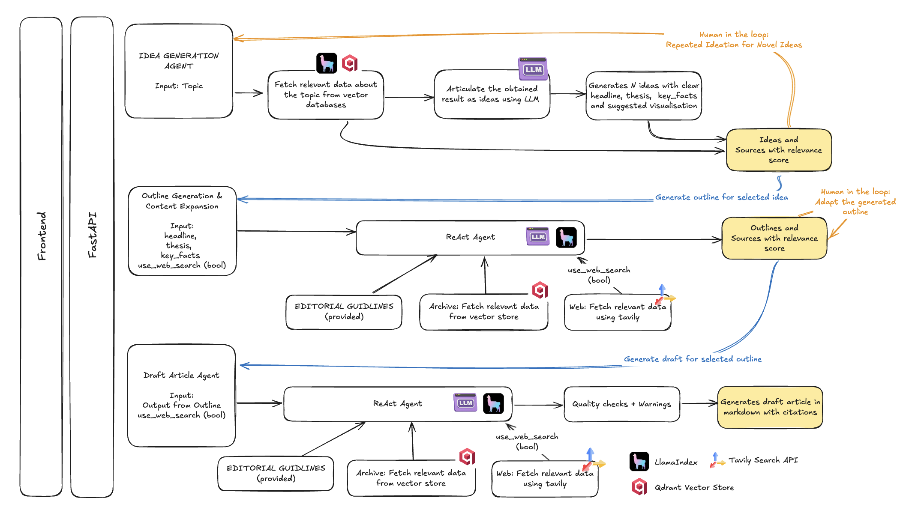

# AI Journalist Assistant - Technical Proposal
**Anand Bhaskaran** | November 2025

## Executive Summary

This proposal presents an **agent-based RAG system** that transforms editorial workflows by combining institutional [archive knowledge](https://github.com/anandbhaskaran/ai-knowledge-assistant/tree/main/data/articles) with real-time web intelligence. The system generates evidence-backed article drafts following the [editorial guidelines](https://github.com/anandbhaskaran/ai-knowledge-assistant/blob/main/data/guidlines/editorial-guidelines.md) with verifiable citations, reducing research-to-draft time drastically.

**Core Innovation**: Multi-source agentic retrieval with citation integrity architecture. Unlike generic RAG systems using single databases and hard-coded pipelines, this solution deploys autonomous ReAct agents that intelligently orchestrate archive search and web research, ensuring every claim traces to verifiable sources through pre-numbered validation.

**Credibility**: Built working prototype validating architecture before proposing full development.

**Live Demo**: [System in Action](https://www.loom.com/share/3b5cd0cc9ee34e34a9852745c75507ff) - 5-minute walkthrough showing MVP that I built based on this proposal.

_Note: This article is also available on [GitHub](https://github.com/anandbhaskaran/ai-knowledge-assistant/blob/main/SOLUTION_SHORT.md) with full source code and documentation._

## 1. System Design & Architecture

**Multi-Tier Architecture**:



**Why ReAct Agents?** Journalism demands multi-step reasoning: historical context (archive), recent developments (web), expert commentary, and synthesis across contradictory sources. Traditional RAG hard-codes retrieval; **ReAct agents** autonomously decide which tools to use, reformulate queries if results poor, and handle contradictions.

**Example Agent Loop**:
```
Query: "AI Impact on Central Bank Policy"
→ Thought: Need historical context
→ Action: archive_retrieval("central bank forecasting methods")
→ Observation: 3 articles (relevance: 0.89, 0.85, 0.82)
→ Thought: Need recent AI adoption data
→ Action: web_search("central banks AI machine learning 2024")
→ Observation: 5 sources (0.94, 0.91, 0.88) - Fed paper, ECB announcement
→ Thought: Contradiction detected (archive: "limited" vs. web: "widespread")
→ Action: web_search("central bank AI implementation timeline")
→ Observation: Pilots 2023, production 2024 - clarified
→ Thought: Sufficient sources (8 total, avg 0.88 relevance)
→ Action: Generate outline with synthesized narrative
```

**Advantages**: (1) Adaptive retrieval with query reformulation, (2) Multi-source intelligence, (3) Transparent reasoning, (4) Contradiction handling

**Data Pipeline**: Text articles → SentenceSplitter (1024 tokens with overlap of 20 tokens) → OpenAI embeddings (ada-002, 1536-dim) → Qdrant vector store → metadata for citations

## 2. Tools & Technologies

| Component | Choice | Rationale | Cost/Scale | Alternative |
|-----------|--------|-----------|-----------|------------|
| **LLM** | GPT-4 | Superior reasoning for citations; function calling | ~$0.03/req | Claude 3.5 (test both) |
| **Agent Framework** | LlamaIndex ReActAgent | RAG-native, 5x faster dev vs. LangGraph | Open-source | LangGraph (Phase 3 multi-agent) |
| **Vector DB** | Qdrant | Open-source, production-ready, cloud migration path | Free→$100s/mo | Pinecone ($70+/mo, vendor lock-in) |
| **Embeddings** | OpenAI ada-002 | Industry standard, $0.0001/1k tokens | Cost-effective | Cohere (test Phase 2) |
| **Web Search** | Tavily API | LLM-optimized, $1/1000 searches | $0.05-0.10/article | Google CSE (fallback) |
| **API** | FastAPI | Type-safe, async, auto-docs | Open-source | Flask |
| **Monitoring** | Grafana + Langfuse | Metrics + LLM observability | ~$100/mo | Next phase |
| **Frontend** | React + Shadcn/ui + TailwindCSS | Rapid UI dev, component library | Vue.js |

**Strategic Decisions**:

**1. No Fine-Tuning for Initial Launch (Defer to Phase 3)**
- **Rationale**: RAG architecture better suited for journalism use case - enables real-time access to latest articles and evolving news without retraining; fine-tuning captures style/patterns but can't access new information or cite specific sources; archive content change frequently, requiring constant retraining cycles; further hosting the fine-tuned model incurs additional costs and maintenance overhead
- **Reconsider when**: (1) need to embed highly specific house style that prompting can't capture, (2) cost optimization required after validating product-market fit (fine-tuned smaller models for routine tasks), or (3) A/B testing shows >15% quality improvement justifies maintenance overhead

**2. Graph RAG Deferred (Phase 3)**
- I've explored and even written about [Graph RAG advantages](https://thecompoundingcuriosity.substack.com/p/rag-is-broken-we-need-connected-entities) but rejected for MVP: adds 4-6 weeks, as we will be implementing an over-engineered solution for a simpler problem
- **Reconsider** when: investigative workflows, archive >10k articles, >20% queries need relationship discovery

**3. Vendor Independence**: LlamaIndex (and LangGraph) abstractions enable LLM swapping (OpenAI ↔ Claude ↔ Llama), embedding changes, multi-search APIs without refactoring

## 3. Training & Fine-Tuning Strategy

**Approach**: Prompt Engineering (Phases 1-2) → Conditional Fine-Tuning (Phase 3)

**Phase 1-2: ReAct Agents with Prompt Optimization** (validated in prototype)

1. [ReAct agents](https://thecompoundingcuriosity.substack.com/p/agentic-ai-part-1-simple-react-agent) autonomously orchestrate archive retrieval + web search tools
2. Structured prompting with [editorial guidelines](https://github.com/anandbhaskaran/ai-knowledge-assistant/blob/main/data/guidlines/editorial-guidelines.md)
3. Pre-numbered source lists (agent can ONLY cite provided sources)
4. Self-verification checklists in prompts
5. Few-shot examples (3-5) for complex reasoning tasks

**Continuous Loop**: Feedback → Failure Analysis → Prompt Refinement → A/B Test → Production

**Expected**: 85-90% editorial quality, 90%+ citation accuracy

**Optimization Techniques Beyond current solution**:

| Technique | Impact | Phase | Complexity |
|-----------|--------|-------|------------|
| Hybrid search (vector + BM25) | +15% retrieval relevance | 2 | Medium |
| Cross-encoder reranking | +10% top-3 source quality | 2 | Low |
| Response caching | -40% API costs | 2 | Low |
| Query expansion (agent) | +20% source diversity | 1 | Low |
| Semantic chunking | +10-15% context preservation | 2 | Medium |
| Citation validation pipeline | -50% hallucinations | 1 | Medium |

**Investment Thesis**: Exhaust low-hanging optimization (caching, hybrid search, prompts) before expensive fine-tuning. Follows OpenAI recommendation: prompt engineering → RAG → fine-tuning.

## 4. Prompt Design Examples

Two specialized prompts guide the ReActAgent through research and writing:

**Outline Generation**: Agent orchestrates archive retrieval + web search through explicit 3-step workflow (historical context → recent developments → synthesis). Key innovation: **refuses to generate** if <4 quality sources found (relevance >0.75), preventing low-quality outputs.

**Draft Generation**: Implements **pre-numbered source lists** preventing hallucinations. Agent receives ranked sources `[1-12]` with excerpts and can ONLY cite using `[N]` notation. Post-generation validation ensures all `[N]` references exist. Result: 90%+ citation accuracy vs. 60-70% in generic RAG.

Both prompts include: (1) editorial guidelines, (2) structural scaffolding with section templates, (3) self-verification checklists, (4) strict citation format enforcement (`[Source, Title, Date]`).

*Full prompts in [Appendix A & B](#appendix-full-prompt-examples).*

## 5. Success Metrics

| Metric | Target | Measurement | Rationale |
|--------|--------|-------------|-----------|
| **Citation Accuracy** | ≥90% | Manual verification: 50 drafts × 10 citations | Editorial credibility. |
| **Factual Correctness** | ≥85% | Expert review: 30 drafts, rate claims | Trustworthy content. <85% = too much editing. |
| **Outline-Topic Alignment** | ≥4.0/5 | Journalist rating (n=20) | User satisfaction. <4.0 = defeats purpose. |
| **Time Savings** | ≥60% | 4hr manual → <90min AI (n=10, 5 articles each) | ROI: 2.4hr × $50/hr = $120 vs. $0.50 cost. |
| **Outline Latency (P95)** | <90s | API monitoring | >90s = attention loss. |
| **Draft Latency (P95)** | <60s | API monitoring | Acceptable wait. |
| **Cost per Article** | <$0.50 | Track API costs per request | $0.50 vs. $120 labor = 240x ROI. Prototype: $0.26. |
| **Human Override** | <15% | % flagged "poor quality" and abandoned | >15% = trust breakdown. |

**Continuous Evaluation using Grafana and Langfuse**:
- **Automated**: Citation accuracy, relevance scores, latency (P50/P95/P99), cost, error rates
- **Human**: Editorial quality ratings, factual correctness, bias detection, NPS surveys
- **Loop**: Feedback → Failure Analysis → Hypothesis → Staging → A/B Test (20%) → Production

## 6. Implementation Roadmap

**Phase 0: Prototype (Completed)** - A demo-able prototype validating architecture

**Phase 1: Production MVP**

- Authentication + Other infra (Kubernetes, CI/CD, monitoring, periodic ingestion pipelines)
- Grafana + Langfuse observability (100% tracing)
- Safety guardrails (bias detection, PII redaction)
- Granular citations, preview popups (>4.0/5 feedback)
- Automated evaluation (500 drafts baseline)
- Pilot launch (10-20 journalists, 80% weekly active, <15% override)

**Phase 2: Scale & Optimization**

| Feature | Expected Value | Approach | Metric |
|---------|-------|----------|--------|
| Hybrid search | +15% quality | BM25 + vector + cross-encoder | Relevance 0.85→0.95 |
| Multi-draft comparison | Better choice | 2-3 angles, journalist selects | +20% satisfaction |
| Fact-checking agent | Fewer errors | Cross-reference claims vs. sources | 85%→92% correctness |
| Version history | Collaboration | Track revisions, compare | 50% adoption |
| Chat with Archive | Better quality publication | Implement chat interface with memory | user engagement |

**Phase 3: Further enhancements** 

| Feature | Moat | Implementation | Metric |
|---------|------|----------------|--------|
| Multi-language | International expansion | 3 languages via GPT-4 | 20% non-English usage |
| Source relationships | Investigative workflows | Graph RAG (optional) | 10% use relationship queries |
| Analytics dashboard | Editorial insights | Trending topics, coverage gaps | 80% editor adoption |

## 7. Risks & Mitigation

| Risk | Impact | Technical Mitigation | Operational Mitigation | Residual |
|------|--------|---------------------|----------------------|----------|
| **Hallucinated Citations** | Critical | Pre-numbered sources (agent can't invent), validation pipeline | Mandatory human review, feedback loop | Low (90%+ accuracy) |
| **Poor Retrieval** | High | Relevance filtering (>0.75), refuse if <4 sources, hybrid search (Phase 2) | User feedback, archive audits | Medium (Phase 2 reduces) |
| **API Downtime** | High | Graceful degradation (archive-only), retry logic, multi-provider failover | Status monitoring, incident playbook | Medium (external dependency) |
| **Cost Overruns** | Medium | Caching (-40% Phase 2), prompt optimization, rate limiting | Daily budget alerts, quota systems | Low ($0.26 validated) |
| **Bias in Content** | Critical | Diverse archive, bias detection models, prompt guardrails | Editorial review, bias audits, training | Medium (human catches most) |
| **Over-Reliance on AI** | Critical | Position as "assistant" in UX, preserve journalist control | Training on AI limitations, quality incentives | Medium (cultural challenge) |

**Technical Debt** (with payoff plan):

1. Vector-only search → Phase 2 Month 5: Add BM25 + reranking when >10% queries <0.70 relevance
2. Manual evaluation → Phase 1 Month 9: Automated pipeline after 100+ labeled examples
3. Single agent → Phase 3: Multi-agent only if data shows clear bottlenecks

**Competitive Advantage**: Most AI journalism tools prioritize speed over trust. Citation integrity + human review = credibility over throughput.

## 8. Conclusion

**Why This Wins**:

1. **Architecture Validated**: Prototype shows great outcomes with easy to use interface
2. **Strategic Choices**: Rejected Graph RAG, deferred fine-tuning, chose ReActAgent, vendor-independent abstractions with LlamaIndex
3. **Journalist-Centric**: Transparent sourcing (pre-numbered citations, reasoning logs), quality thresholds (refuse if insufficient sources), human-in-loop design
4. **Improves productivity**: Facilitate ideation for journalists, streamline research, sparing partner for journalists 

**Differentiation vs. Generic RAG**:

| Dimension | This Solution | Typical RAG | Advantage |
|-----------|---------------|-------------|-----------|
| Intelligence | Autonomous agent: archive + web + future tools | Single DB, hard-coded | Comprehensive research in one query |
| Trust | Pre-numbered validation: 90%+ accuracy | Generic sources: 60-70% | Editorial credibility, legal risk reduction |
| Adaptability | Editorial guidelines | Hard-coded prompts | Scales across publications |
| Cost Control | Optional web search, caching roadmap | Always-on APIs | Flexible cost/quality trade-off |
| Transparency | Agent reasoning logs visible | Black-box | Journalists understand WHY |


**Contact**: [Anand Bhaskaran](https://home.anand-creations.com/) | [MVP in GitHub](https://github.com/anandbhaskaran/ai-knowledge-assistant) | [Live Demo](https://www.loom.com/share/3b5cd0cc9ee34e34a9852745c75507ff) | [My Blogs](https://home.anand-creations.com/blog)

## Appendix: Full Prompt Examples

### A. Outline Generation Prompt (from `outline_agent.py`)

```markdown
You are an AI Journalist Assistant creating a detailed article outline.
Follow the editorial guidelines strictly.

EDITORIAL GUIDELINES:
{editorial_guidelines}  # Loaded via RAG from editorial-guidelines.md

ARTICLE DETAILS:
- Headline: {headline}
- Thesis: {thesis}
- Key Facts to Incorporate: {key_facts}
- Suggested Visualization: {suggested_visualization}

YOUR TASK:
1. Use the archive_retrieval tool to find relevant articles and information
   - Search for background context on this topic
   - Find supporting facts, statistics, and quotes
   - Look for expert opinions and analysis
   - Retrieve multiple perspectives

2. Use the web_search tool for very recent information (if enabled)
   - Find breaking news and recent developments
   - Get diverse viewpoints from authoritative sources
   - Gather current statistics and data

3. Create detailed markdown outline with this structure:

## Headline
[Use provided or refine to 60-80 characters following guidelines]

## Introduction (100-150 words)
**Hook:** [Compelling and timely opening]
**Context:** [Background with citations [Source, Date]]
**Thesis:** {thesis}
**Why This Matters Now:** [Current relevance and stakes]

## Body Sections
### [Section Heading - Clear and Specific]
**Key Point:** [Main argument]
**To Cover:**
- [Point with citation [Source, Title, Date]]
- [Supporting evidence from sources]

[Repeat for 3-5 sections]

## Data Visualization
{suggested_visualization or suggest based on retrieved information}

## Conclusion
**Synthesis:** [Tie arguments together]
**Implications:** [What this means going forward]
**Final Thought:** [Memorable closing]

## Sources Used
[List all sources with [Source, Title, Date] and contribution]

CRITICAL RULES:
- ONLY use information from retrieved sources - never invent facts
- Every claim must cite source in format [Source, Title, Date]
- Follow editorial guidelines for voice, tone, and structure
- If insufficient sources: "Insufficient sources found in archive"

Begin by using the archive_retrieval tool.
```

### B. Draft Generation Prompt (from `draft_agent.py`)

```markdown
Your task is to write a complete article NOW.

CRITICAL: Your response must be ONLY the article text. Do NOT write
explanations. Start directly with the article headline (# format).

EDITORIAL GUIDELINES:
{editorial_guidelines}

ARTICLE DETAILS:
Headline: {headline}
Thesis: {thesis}
Target Word Count: {target_word_count} (MUST be {min}-{max} words)

OUTLINE TO FOLLOW:
{outline}

AVAILABLE SOURCES (from outline generation):
Source 1:
- Title: {source['title']}
- Source: {source['source']}
- Type: {source['source_type']}  # 'archive' or 'web'
- Date: {source['date']}
- Relevance: {source['relevance_score']}
- Excerpt: {source['text'][:300]}...

[Sources 2-12...]

WRITING INSTRUCTIONS:

1. STRUCTURE:
   - Follow outline BUT may add sections to meet word count
   - Use H2 (##) and H3 (###) headings from outline
   - Remove outline placeholders like "**To Cover:**", "**Key Point:**"
   - Start with compelling intro, end with strong conclusion
   - 3-5 paragraphs per body section (more if needed for word count)

2. CONTENT QUALITY:
   - Write for intelligent non-specialists
   - Explain technical terms with examples
   - Use concrete examples and case studies
   - 15-20 words per sentence average
   - 2-4 sentences per paragraph
   - Thorough and comprehensive

3. SOURCES & CITATIONS:
   - PRIMARY RULE: Use ONLY numbered sources above (Source 1, 2, 3...)
   - Every factual claim MUST have inline citation
   - Citation format: [1], [2], [3] immediately after claim
   - Example: "AI achieves 95% accuracy [1]."
   - Minimum 3 distinct sources
   - Use same number for repeated source citations

4. EDITORIAL STANDARDS:
   - No clickbait or sensationalism
   - No unverified claims
   - Clear positions while acknowledging complexity

CRITICAL RULES:
- NEVER fabricate sources, statistics, or quotes
- NEVER cite sources not provided
- ALWAYS cite claims - uncited factual claims unacceptable
- ALWAYS follow editorial guidelines

OUTPUT FORMAT:
# {headline}

[Start introduction immediately...]

Do NOT include preamble, explanations, or meta-commentary.
Just write the article starting with "# {headline}".
```
